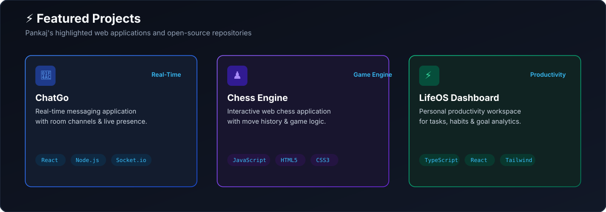

<!-- ========================================== -->
<!--            GITHUB HERO BANNER              -->
<!-- ========================================== -->
<div align="center">
  <picture>
    <source media="(prefers-color-scheme: dark)" srcset="./assets/hero-banner-dark.svg">
    <source media="(prefers-color-scheme: light)" srcset="./assets/hero-banner-light.svg">
    
  </picture>
</div>

<br />

<!-- ========================================== -->
<!--          TYPING BANNER & METRICS           -->
<!-- ========================================== -->
<div align="center">
  <a href="https://git.io/typing-svg">
    
  </a>
</div>

<br />

<div align="center">
  
  
  
</div>

<br />

---

<!-- ========================================== -->
<!--               ABOUT ME                     -->
<!-- ========================================== -->
## 👨‍💻 About Me

```javascript
const developer = {
  name: "Your Name",
  role: "Full Stack Engineer & Open Source Craftsman",
  code: ["TypeScript", "JavaScript", "Python", "Go", "C++"],
  technologies: {
    frontend: ["React", "Next.js", "Tailwind CSS", "Redux"],
    backend: ["Node.js", "Express", "FastAPI", "GraphQL"],
    database: ["PostgreSQL", "MongoDB", "Redis"],
    devops: ["Docker", "Kubernetes", "AWS", "GitHub Actions"]
  },
  currentFocus: "Building multi-agent AI systems & modern web applications",
  askMeAbout: ["Web Development", "Software Architecture", "UI/UX Design", "Open Source"],
  funFact: "I turn coffee ☕ into clean, maintainable code 💻"
};
```

- 🔭 **Currently working on:** Next-generation web applications & AI integrations
- 🌱 **Learning & Exploring:** Rust, Distributed Systems & Advanced LLM Agents
- 💬 **Ask me about:** React, Node.js, System Architecture, and UI/UX best practices
- ⚡ **Fun fact:** Passionate about clean code, keyboard shortcuts, and open-source software

<br />

---

<!-- ========================================== -->
<!--             TECH STACK & TOOLS             -->
<!-- ========================================== -->
## 🛠 Tech Stack & Tools

<div align="center">

### Languages


### Frontend Frameworks & Design


### Backend & Cloud


### Databases & Developer Tools


</div>

<br />

---

<!-- ========================================== -->
<!--          FEATURED PROJECTS SHOWCASE        -->
<!-- ========================================== -->
## 🌟 Featured Projects

<div align="center">
  <picture>
    <source media="(prefers-color-scheme: dark)" srcset="./assets/projects-showcase-dark.svg">
    <source media="(prefers-color-scheme: light)" srcset="./assets/projects-showcase-light.svg">
    
  </picture>
</div>

<br />

<div align="center">

| Project | Description | Tech Stack | Live Demo |
| :--- | :--- | :--- | :---: |
| **🤖 AI Assistant Hub** | Intelligent autonomous agent workspace with multi-modal tools | `TypeScript` `Next.js` `OpenAI` | [🔗 Demo](https://github.com/YOUR_USERNAME) |
| **🚀 Cloud Microservices** | Ultra-fast event-driven streaming microservices template | `Go` `Docker` `Redis` | [🔗 Demo](https://github.com/YOUR_USERNAME) |
| **🎨 Modern Design System** | Accessible React component library with light/dark themes | `React` `Tailwind` `Storybook` | [🔗 Demo](https://github.com/YOUR_USERNAME) |

</div>

<br />

---

<!-- ========================================== -->
<!--             GITHUB STATS & STREAK          -->
<!-- ========================================== -->
## 📊 GitHub Analytics

<div align="center">
  <picture>
    <source media="(prefers-color-scheme: dark)" srcset="https://github-readme-stats.vercel.app/api?username=YOUR_USERNAME&show_icons=true&theme=tokyonight&hide_border=true&count_private=true">
    <source media="(prefers-color-scheme: light)" srcset="https://github-readme-stats.vercel.app/api?username=YOUR_USERNAME&show_icons=true&theme=default&hide_border=true&count_private=true">
    
  </picture>
  &nbsp;
  <picture>
    <source media="(prefers-color-scheme: dark)" srcset="https://github-readme-stats.vercel.app/api/top-langs/?username=YOUR_USERNAME&layout=compact&theme=tokyonight&hide_border=true">
    <source media="(prefers-color-scheme: light)" srcset="https://github-readme-stats.vercel.app/api/top-langs/?username=YOUR_USERNAME&layout=compact&theme=default&hide_border=true">
    
  </picture>
</div>

<br />

<div align="center">
  <picture>
    <source media="(prefers-color-scheme: dark)" srcset="https://streak-stats.demolab.com?user=YOUR_USERNAME&theme=tokyonight&hide_border=true">
    <source media="(prefers-color-scheme: light)" srcset="https://streak-stats.demolab.com?user=YOUR_USERNAME&theme=default&hide_border=true">
    
  </picture>
</div>

<br />

---

<!-- ========================================== -->
<!--          CONTRIBUTION SNAKE GAME           -->
<!-- ========================================== -->
## 🐍 Contribution Graph Animation

<div align="center">
  <picture>
    <source media="(prefers-color-scheme: dark)" srcset="https://raw.githubusercontent.com/YOUR_USERNAME/YOUR_USERNAME/output/github-contribution-grid-snake-dark.svg">
    <source media="(prefers-color-scheme: light)" srcset="https://raw.githubusercontent.com/YOUR_USERNAME/YOUR_USERNAME/output/github-contribution-grid-snake.svg">
    
  </picture>
</div>

<br />

---

<!-- ========================================== -->
<!--             CONNECT & SOCIALS              -->
<!-- ========================================== -->
## 🌐 Connect With Me

<div align="center">

[](https://linkedin.com/in/YOUR_LINKEDIN)
[](https://instagram.com/YOUR_INSTAGRAM)
[](https://facebook.com/YOUR_FACEBOOK)
[](mailto:your.email@example.com)

</div>

<br />

---

<!-- ========================================== -->
<!--                 FOOTER                     -->
<!-- ========================================== -->
<div align="center">
  <p><i>"The best way to predict the future is to invent it."</i> — Alan Kay</p>
  
</div>
